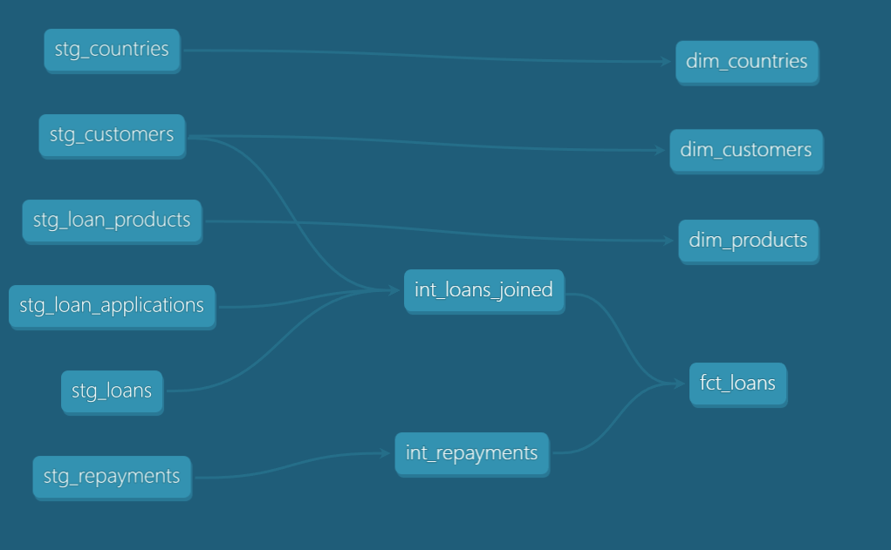
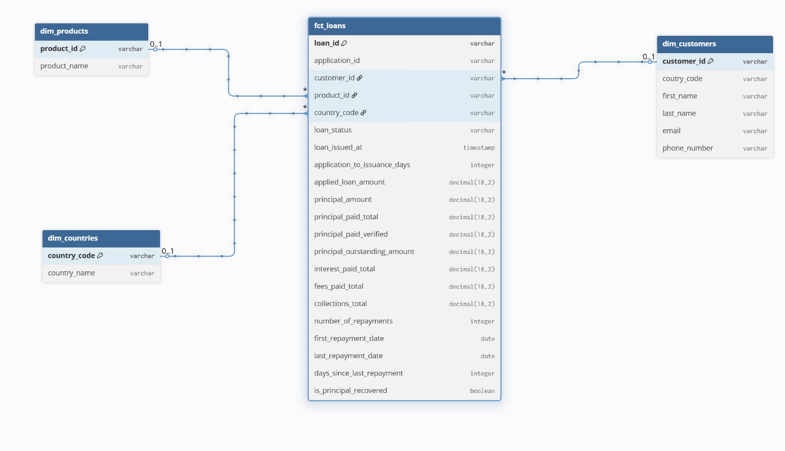

# Part 1

**Data pipeline for Bondora loan data using dbt and DuckDB.** The goal is to transform raw CSV and JSON files into an optimized, self-service dataset for analysis and monitoring of key metrics.

---

## Tools

- **dbt** — SQL transformations and data modeling (including model tests and documentation).
- **DuckDB** — Local analytical database used for ingestion and processing of the pipeline. This was most viable option to deploy the whole system locally without setting up the server or cloud infrastructure. It also provided native read options to directly load the data.
- **Python** — Initial data cleaning and transformation notebook.

---

## Architecture

### 1. Staging

- Ingest raw files from the `source_data/` folder (CSV/JSON).
- Used duckdb's readers to get the raw data directly into staging. This could also have been done using `seeds` which is mostly used for static datasets but to be on a bit realistic side, I used the native option for duckdb.
- Standardize column names and datatypes.
- Apply basic cleaning and validation to prepare data for transformations.

### 2. Intermediate

- Perform core transformations (joins, aggregations, enrichments).
- Transform staging models into intermediate models (`int_loans_joined` and `int_repayments`) that capture meaningful business definitions.
- Below is the lineage chart describing the overall flow.

### 3. Marts

- Build analyst-facing star schema (dimensions and fact tables).
- Provide clean, documented datasets ready for dashboards and reporting.
- Here is the ERD for this layer.

---

## Data sources

- Files are stored in `source_data/` (e.g., `customers.csv`, `loans.csv`, `repayments.csv`, `countries.json`, `loan_product.csv`, `loanapplications.csv`).

---

## Data Quality
- In the `stg_loans_applications` dataset, 3 `customer_ids` were found to be not present in `Customer` dataset which resulted in failing relationship test.

## Schema and Materialization
- Considering the scale and size of the data, I used single schema per layer to document quality tests and desciptions of models.
- For materialization, Staging and Intermediate layers are set as `Views` by default for data freshness and storage optimization purpose while Marts are set as `Tables` for better query perfomance for BI.
    Intermediate layer could have been materialized as `Ephemeral` but the models (specially financial metrices) seems reuseable at this stage as well so made them `Views`. Also `int_repayments` carries aggregations so materialized it as `Table` specifically for better performance.
- Since the dimensions tables data already is in clean shape at staging, I directly called it into Marts rather just duplicating it in Intermediate layer first and then again in marts.

## Improvements (To Do's)
- **SCD Traking** - To capture the changing detailes in `Customers` table. I would add `valud_from`, `valid_to` and `is_current` flag columns also given the dates provided seperately or use dbt snapshots to automatically generate these.
- **Partitioning and Clustering** - In the production cloud environment, would have also applied partitioning and clustering on key models like `fact_loans` to optimize the perfomance.
- **Tags** - Would also have applied tags at model/layer level.
- **Date Dimension** - I would have also add a dim_date table in marts for cohort analysis and also for stardizing the BI reporting.
- **Handle Test failures** - Knowing the more context behind the test failure decribed in `Data Quality`, would design a system to handle these issues as well.

## Running the project (local)

1. Ensure you have dbt installed and a local DuckDB database configured (this project uses `dev.duckdb`).
<small>(Note: This is the only part where I got some help from AI)</small>

2. Run models:

    dbt run

3. Run tests:

    dbt test

---

 **Tip:** Check the `models/` and `source_data/` folders for details and examples of model logic and source files.

---

# Part 2

## Data Quality at Scale
- In the upscale production environment, it would be highly appropriate to use dbt's `state` functionality to update/change only the models which are changed as result of any PR. This would reduce the run time and unnessary processing.
- Use/build macros to standardize the key logics and maintain coding standards.
- Ensuring the idempotency of the pipeline as top priority.

## CI/CD Process
- People work on feature branches using local warehouse environment to implement the changes.
- For every completed change, PR will be initiated and reviewd by the dedicated person to meet the requirement.
- PR would also trigger by defailt `dbt test` to test the changes.
- Code will be reviewd on business logic and coding standards.
- Once approved, it will be merged and changes deployed to the production environment.
- Automated alert system would monitor the production failures afterwards.

## Focus Areas
- **Immediate Focus** - Implementing tests and documentation standars, setting-up automated slack/email alerts for job failures.
- **Long-term Focus** - depending on the size and scope of data, implement incremental materialization and historic tracking, keep on utilizing efforts to automate the process to the core.

## Environment, Tests, Tools and Practices
- **Environments** -Local development and personal sandboxes in Databricks, Github or Azure DevOps.
- **Tests** - model level testing, custom SQL tests, pipeline data freshness tests.
- **Practices** - Version controls, documentations, idempotency
- **Tools** - dbt, databricks.

## Ideal CI/CD Process
To me, an ideal process would be combination of above mentioned process and tools with more laverage to `automation` and `strict monitoring` to maintain the data quality